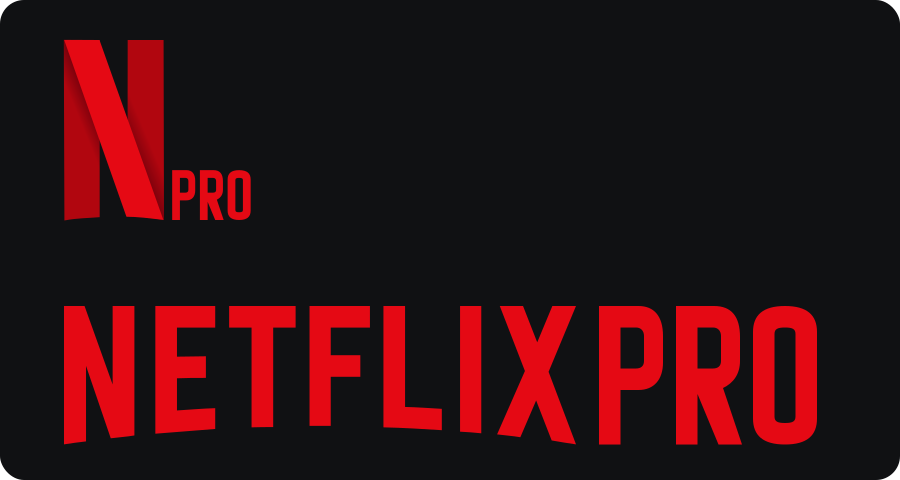

# NetflixPro vector branding

The compact **Npro** lockup retains the shaded red ribbon and adds condensed PRO lettering at its lower-right baseline. The full **NETFLIXPRO** wordmark extends the existing lettering with matching weight and spacing. Every letter is an outline: the production SVGs have transparent backgrounds and no font or external image dependency.

Source exports: [`npro.svg`](../../assets/branding/npro.svg) (1044 × 1000) and [`netflixpro.svg`](../../assets/branding/netflixpro.svg) (1506 × 277). The existing drawable/SVG names remain compatible aliases so all consumers receive the new branding. Shared Compose geometry keeps the full lockup visible; direct placements and the splash anchor use the new proportions. Adaptive foregrounds fit inside the 66 dp safe circle, and legacy launcher icons are regenerated for every density.

Android vectors and SVG exports match across TV and mobile. Mobile native Home captures are in the mobile repository’s `docs/design-preview`; the TV app also uses the new assets in its launcher banner and home-channel logo. The website/favicon and reusable video artwork use the same SVG paths; the video renderer preserves aspect ratios and the hollow counters in PRO. Existing rendered advertising videos and historical runtime screenshots are not regenerated by this change.
