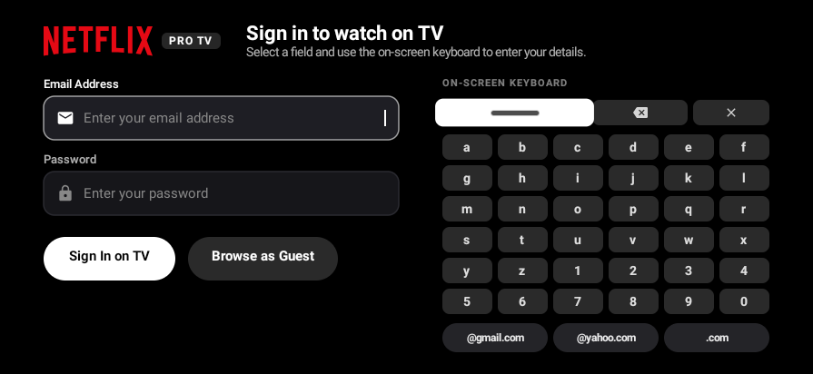

# Final TV auth checks

Captured from the final normal debug APK on an API28 software emulator. This APK was installed separately after the website-update test to exercise the auth idle/focus follow-up. Its update endpoint is blank.

The focused Space key has a dark mark on the white focus background. Sign-in stayed visible without remote input for 118 seconds, beyond the 60-second screensaver timeout; the ambient screen did not enter and no fatal exception occurred. Device screen sleep was disabled for this app-level idle check. This does not validate physical-TV timing or focus across every screen.

