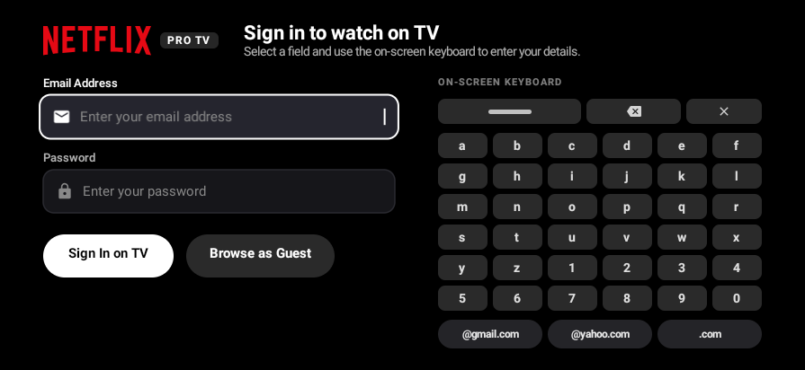
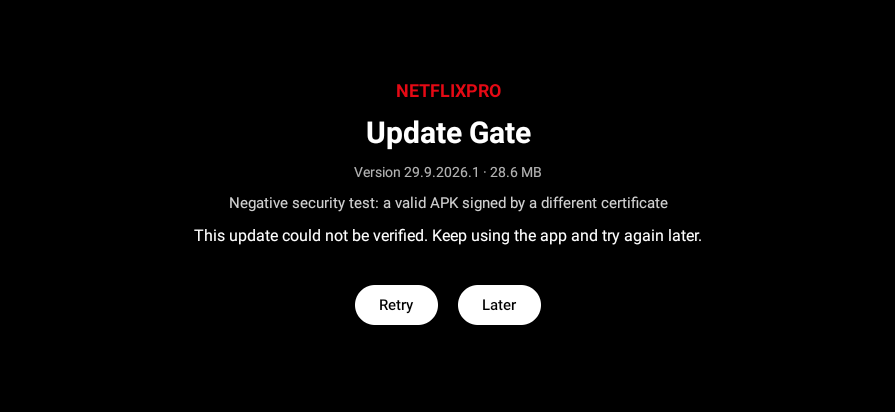
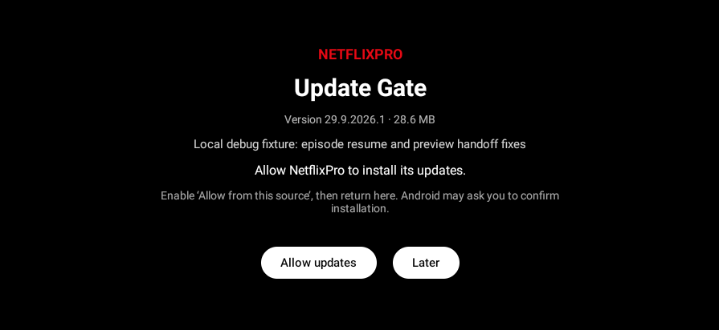
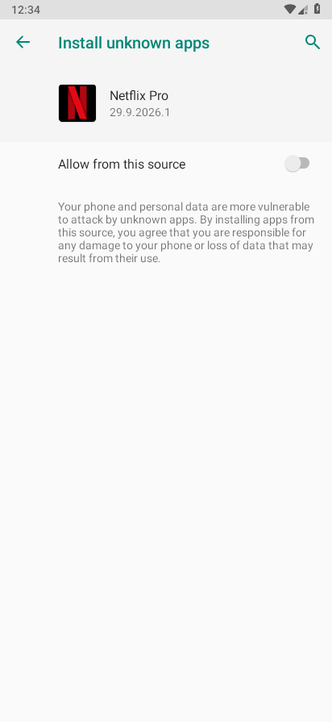
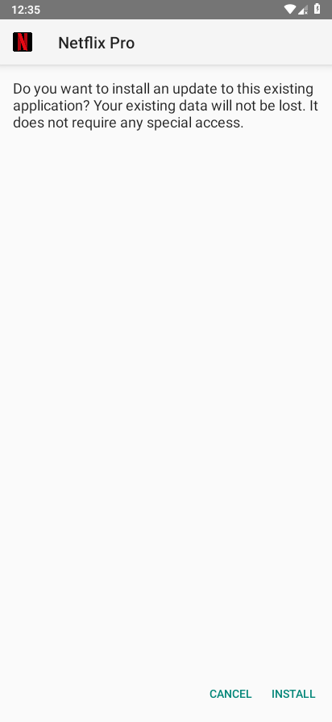
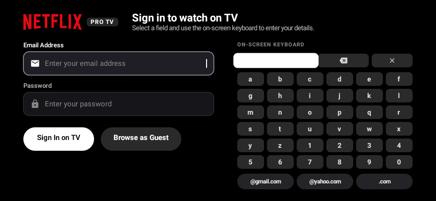

# Local website update test

Tested on an Android 9/API 28 software emulator using the actual debug app code. Fixtures use version codes 29092026 (baseline) and 29092028 (update), signed by the same cloud debug key. Both retain the original display version name. APK version metadata and the update-site asset were changed outside the checkout; these are local test fixtures, not production release APKs.

The baseline was installed with adb. The newer APK was served by a local HTTPS website, downloaded by the app's DownloadManager, verified in private storage, and installed through Android's permission settings and installer confirmation. The newer APK was not installed with adb. Android confirmed versionCode 29092028 after installation.

A separate valid APK with versionCode 29092029, the correct size/hash/package metadata, and a different certificate was rejected; the baseline version stayed installed. A manifest with available=false opened normal auth without Update Gate. No AndroidRuntime fatal exception occurred during the successful update.

This test uncovered Android 9's archive-certificate behavior: getPackageArchiveInfo collects certificates only when GET_SIGNATURES is requested. Both apps now request that flag alongside modern signing information, retaining the exact current-signer comparison. Retry also distinguishes verification failures from network failures. APK size, SHA-256, package, version, minSdk and standalone-package checks remain enforced.

TLS certificate verification stayed enabled. A temporary local CA was trusted only inside the isolated test AVD; the host server supported exact Content-Length, Range requests and ETag. Neither the certificate key nor debug APK fixtures are committed or published. Original release signing, the eventual deployed site and device-specific behavior still need validation.

The update fixtures preceded the additional auth idle/focus follow-up. Final auth checks use a separate normal debug APK; see `../emulator-auth`.
