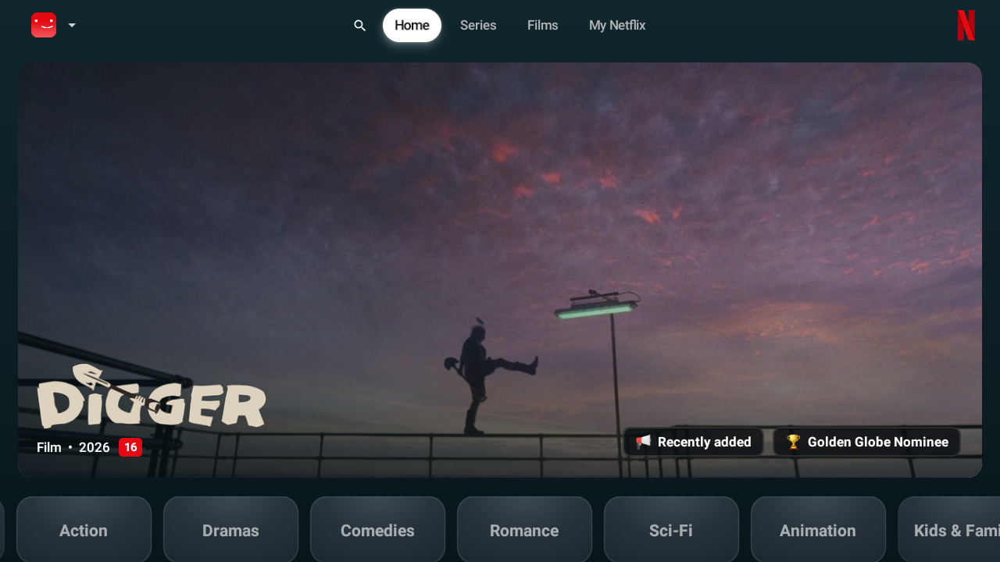
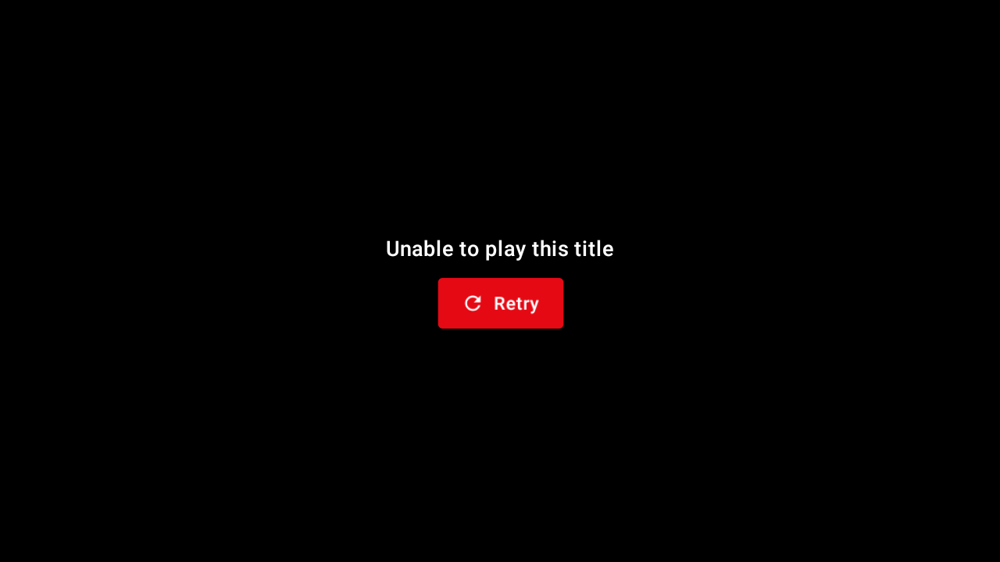

# Android TV runtime audit

Test target: official Android TV API28 x86 image, TV 720p (1280 × 720, density 213), one software CPU, 1536 MB RAM, SwiftShader, debug APK. The cloud host has no KVM. Normal animation scales remained enabled. Tests use the supplied authorized account and an existing profile; credentials, account screenshots and raw provider logs are excluded.

## Changes under review

- Search results, Home categories and movie cards use 1.5 dp focus outlines.
- Horizontal carousel and vertical Home movement use the same spring stiffness, preserving existing row anchors and held-key handling.
- Fresh unauthenticated startup defers catalog work until authentication/guest entry. Existing sessions continue warming the catalog during splash.
- MainActivity uses singleTop for repeated playback intents. Standalone playback has a Home/profile fallback when Back cannot pop a screen.
- Playback resolution depends on access eligibility rather than every subscription metadata update, avoiding unnecessary cancellation/restarts.
- Debug monotonic markers record resolver completion (including failure/cancellation), the first owned player video frame, and the first preview frame actually revealed. No URLs or account values enter these markers.
- Profile-setup avatars retain a visible fallback while their remote image is unavailable. A new auth attempt clears its old error message.

## Measured startup

The baseline cold activity first draw was **20.526 s**. A later cold draw after startup deferral was **21.622 s**. Different boot/JIT/shader caches and software CPU contention prevent an improvement claim; these measurements do not demonstrate faster first draw. Baseline frame statistics report 100% janky frames across startup and navigation; this software result is unsuitable for a physical-TV smoothness claim.

Catalog initial work was observed twice (~18.956 s and ~19.672 s) during the earlier repeated activity/deep-link attempt. The singleTop change is intended to reuse the activity. Android-shell deep links can still recreate a task through Navigation handling; these runs do not demonstrate activity reuse or a startup speedup. A same-device controlled comparison on physical hardware remains needed.

## Measurement definitions

`player_resolution_finished` starts immediately before resolver IO and includes failures/cancellation. `player_first_frame` starts when the player attempt is composed; it is not measured from the remote's Play press. Preview requested-to-visible starts at preview request and includes focus debounce, player-idle/network work, prepare/seek and the visible-frame guard. Host observation includes ADB polling and screenshot overhead and must not be presented as app startup latency.

The existing preview focus debounce remains 2.8 seconds. No measured preview speedup is claimed. A brief rendered-frame observation is a playback smoke check, not long-session stability validation. Failures/timeouts do not count as playable titles.

## Environment limitations and release work

API28 includes WebView 66; provider compatibility on modern WebView must also be tested. Android system Live Channels DVR crashes were disabled only in this isolated AVD; original SDK images were preserved. Cloud CA certificates were added to its temporary writable overlay while TLS verification remained enabled. The app's trust policy and membership gate were unchanged.

There is no supported live emulator link in this interface. Reviewable screenshots can be stored here after checking for personal data. A recording must be captured separately from timed runs because encoding changes software-emulator load.

The original release signing key and replacement public update URL are still absent. Physical-TV timings, long-session playback, live next-episode/resume verification and any unavailable-screen checks remain release verification work; passing debug tests does not certify production readiness.

## Ten authenticated stream attempts

Five movies: Dune, The Dark Knight, Inception, Interstellar, The Matrix. Five shows (S1E1): Mr. Robot, The Last of Us, Squid Game, Stranger Things, Wednesday. **No first video frames rendered.** Resolver-ended durations ranged from 18.807 to 52.427 seconds. See [machine-readable results](streams.json) and [timing CSV](streams.csv).

Mr. Robot returned no source after 20.259 s. The UI displayed “Unable to play this title” with Retry. Native diagnostics repeatedly reported “Handshake failed”; verification endpoints sometimes returned HTTP 200 without the required session cookie. A later host check also rejected a proxy CONNECT to net52.cc while userver.net52.cc responded. These observations identify a provider/network session prerequisite, but do not isolate its complete root cause or prove the titles unavailable. Premium membership was confirmed active and unexpired in the emulator.

Android-shell deep links may recreate the navigation task. Device resolver clocks therefore remain separate from host observation and user-click latency; these tests do not prove profile/focus preservation across every deep link. Exception class names in results are **log mentions**, including Android class verification messages, not proof those exceptions were thrown.

Next-episode playback, live resume persistence, player audio/subtitle/settings behavior, and first-frame preview comparisons could not be verified without a playable source. Prior episode-resume unit tests passed. The unresolved runtime checks remain on the checklist.

## Cold-play/session renewal corrections

The follow-up [warming and renewal plan](warmup-plan.md) records the startup, Home, Details and foreground handoff rules. Play now joins the session generation directly instead of first spending up to 20 s waiting on the background job. A foreground request can promote an existing native handshake to browser recovery; cancellation removes that demand and cleans up promoted browser work. Ordinary native handshake exceptions can reach foreground fallback, including on low-RAM TVs with an installed WebView. Home/preview-only warming remains native-only without a foreground request.

Natural cookie expiry now clears dependent nonce/routing/manifest state and changes the generation. Cached-stream hits require a complete unexpired session. The ten-title runtime measurements above preceded these corrections; **live playback recovery after the change has not been verified**.

Final local TV validation: 155 tests executed, 151 passed, four opt-in live TMDB skips; debug build and lint passed. UI navigation sampling subsequently hit an Android input-command timeout, so held-row/vertical smoothness, Search/category focus screenshots and all-screen timing remain incomplete. The thinner 1.5 dp rings and shared horizontal/vertical spring are implemented, not a demonstrated physical-device speedup. The temporary native test account was cleared from the isolated AVD after testing.
