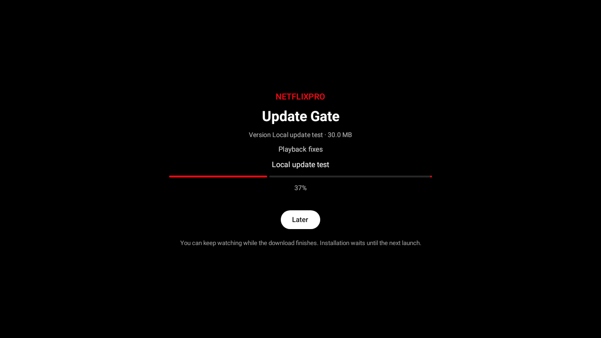
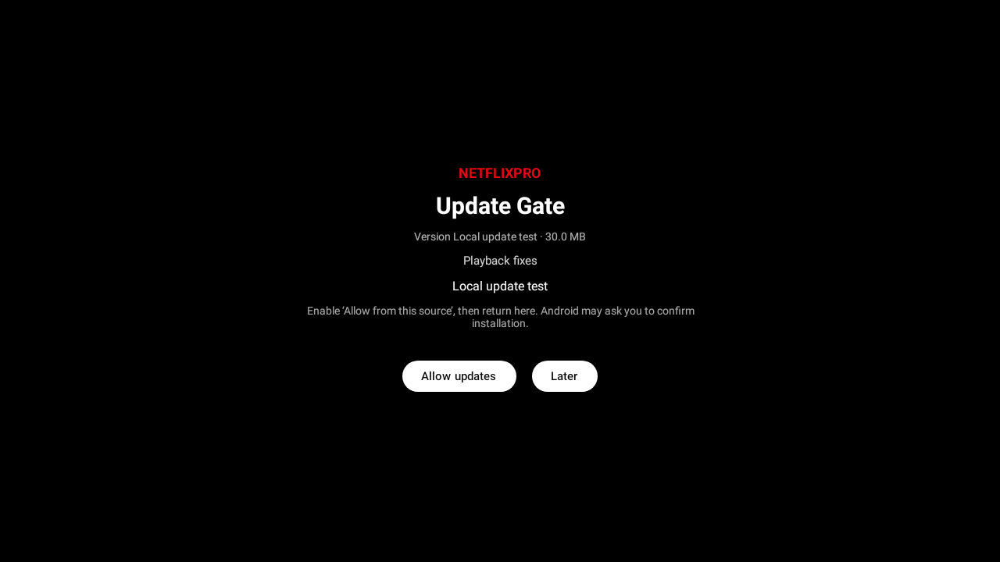
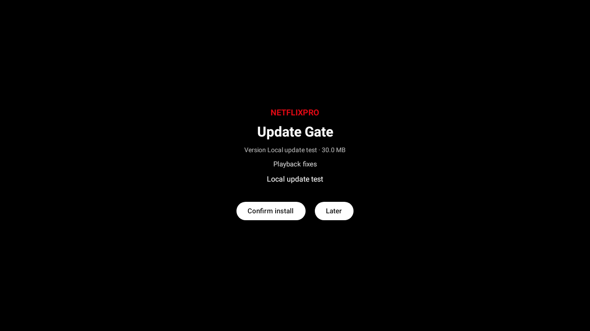

# Update-gate UI previews

Captured from the actual Compose screen with Robolectric native graphics on Android 34 (1280 × 720). The release metadata is a local test fixture. These show screen rendering and button behavior; they do not establish that Android downloaded or installed an APK.

